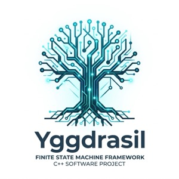

<p align="center">

</p>
# 🌳 Yggdrasil

> **The declarative, reflection-powered Finite State Machine framework for modern C++26.**

Yggdrasil is a highly declarative, attribute-driven Finite State Machine (FSM) framework that makes writing complex state logic as easy as reading a configuration file. By leveraging bleeding-edge **C++26 reflection** (`<meta>`), Yggdrasil unifies your state topology, data, and event handlers into a single, cohesive, zero-boilerplate structure.

## 🌟 Key Features

* **Declarative & Self-Documenting:** Say goodbye to convoluted transition tables and massive `switch` statements. Yggdrasil uses C++ attributes like `[[=transition(state::open)]]` directly on your event handlers. The code *is* the documentation.
* **Zero-Boilerplate Data Management:** Variables are automatically tracked and initialized. Need to initialize `leavesQty` from `orderSize`? Just write `[[=init_from<^^orderSize>{}]]`. Read-only accessors (getters) are generated automatically, ensuring state can only be modified through valid events.
* **Intelligent Data Mapping:** Track historical data (like trades on an order) natively. With `[[=mapping<^^trades>{}]]` and `[[=storage_key{}]]`, Yggdrasil automatically hashes, stores, and maps incoming event data without manual map-insertion logic.
* **Safe by Default (and Revertible):** Yggdrasil forces you to define valid endpoints and automatically rejects invalid events with rich errors like `[[=on_error("Order already filled")]]`. It even supports reverting from final states via `[[=can_revert_final{}]]`.
* **Seamless Testability:** Generated FSM event handlers return `std::expected<void, std::string>`, making unit testing incredibly straightforward.

## 📖 The Etymology
In Norse mythology, **Yggdrasil** is the immense, sacred World Tree whose branches and roots connect the Nine Worlds of the cosmos. 

The metaphor for a finite state machine is perfect:
* **The Branches and Roots:** The complex, branching paths of your state transitions.
* **The Worlds:** The distinct states (e.g., `open`, `filled`) your application exists in.
* **The Tree Itself:** The framework. Yggdrasil is the robust, centralized structure that connects isolated states and guides data safely between them.

## ⚡ Quick Start

Yggdrasil allows you to define your states, events, and data in a single `struct`. Here is an example of an Order Execution state machine:

```cpp
#include <yggdrasil/state_machine.hpp>
#include <string>
#include <unordered_map>

using namespace yggdrasil;

struct order_state : state_machine {
    // 1. Define States and Events
    enum class state { uninited, order_received, open, partially_filled, filled, order_rejected, order_canceled };
    enum class event { new_order, trade, bust_trade, cancel };
    
    state order_state {};
    std::string symbol;
    uint32_t orderSize{};
    
    // 2. Zero-Boilerplate Initialization (using C++26 reflection variables)
    [[=init_from<^^orderSize>{}]]
    uint32_t leavesQty{};
    
    [[=init_val<0>{}]]
    uint32_t cumQty{};
    
    // 3. Define Transitions and Error Handling
    [[=initial{}]]
    auto to_order_received(std::string_view symbol, uint32_t orderSize) -> any_of<state::open, state::order_rejected>;

    [[=on_error("Order already open")]]
    auto to_open() -> any_of<state::order_canceled, state::partially_filled, state::filled>;
    
    auto to_partially_filled() -> any_of<state::order_canceled, state::partially_filled, state::filled>;

    [[=on_error("Order already filled")]]
    auto to_filled() -> final;
    
    // 4. Bind Events to Handlers
    [[=transition(state::open)]]
    on new_order(double price) {
        return accepted;
    }
    
    // Define a map to automatically store trade data
    struct trade_data_t {
        uint32_t fillQty {};
        double fillPx {};
    };
    std::unordered_map<std::string, trade_data_t> trades;

    // Yggdrasil automatically inserts into `trades`, extracting `tradeId` as the map key
    [[=transition(any_of<state::partially_filled, state::filled>{})]]
    [[=mapping<^^trades>{}]]
    [[=on_error("Duplicate Trade ID")]]
    on trade([[=storage_key{}]]std::string_view tradeId, uint32_t fillQty, double fillPx) {
        leavesQty -= fillQty;
        cumQty += fillQty;
        return leavesQty ? to(state::partially_filled) : to(state::filled);
    }

    // You can even revert from a final state (like filled) using can_revert_final!
    [[=can_revert_final{}]]
    [[=transition(any_of<state::partially_filled, state::open, state::order_canceled>{})]]
    [[=on_error("Trade to bust not found")]]
    on bust_trade(std::string_view tradeId) {
        if (auto it = trades.find(std::string(tradeId)); it != trades.end()) {
            cumQty -= it->second.fillQty;
            leavesQty += it->second.fillQty;
            trades.erase(it);
            
            if (order_state == state::filled) return to(state::order_canceled);
            if (cumQty > 0) return to(state::partially_filled);
            return to(state::open);
        }
        return rejected;
    }
};
```

### Using the State Machine

Yggdrasil uses C++26 metaprogramming to generate a fully-featured proxy object wrapped around your definition:

```cpp
// Generate the FSM
auto fsm = build_state_machine_type<order_state>{};

// Initialize (moves to 'order_received')
fsm.initialize("AAPL", 100);

// Fire events! Returns std::expected<void, std::string>
auto result = fsm.new_order(155.0);
if (result.has_value()) {
    // Accessors are automatically generated!
    std::cout << "State: " << (int)fsm.order_state() << "\n";
    std::cout << "Symbol: " << fsm.symbol() << "\n";
}

// Data mapping automatically tracks your data
fsm.trade("T001", 40, 154.5);
std::cout << "Trades recorded: " << fsm.trades().size() << "\n";

// Invalid transitions safely return unexpected errors
auto bad_transition = fsm.trade("T002", 100, 155.0); 
// bad_transition.error() == "Order already open" (if called in wrong state, e.g. uninited)
```

### 🏎️ Driver License Example

Check out `examples/driver_license.cpp` for a comprehensive, real-world demonstration of Yggdrasil's capabilities. It models a driver license registration system, utilizing:
- **`any_of` target routing**: Events can conditionally route into multiple valid states based on their logic (e.g. passing a test goes to `licensed`, failing goes to `rejected`).
- **`[[=can_revert_final{}]]`**: Demonstrates overriding final state lockouts (e.g. paying fines to clear a `revoked` license).
- **`[[=mapping<^^..._>{}]]` Collections**: Automatically records driving citations against the driver's record and guards against duplicate tickets.

You can compile and run it instantly:
```bash
./examples/run_driver_license.sh
```

## 📝 Detailed Annotations & Features

Yggdrasil uses C++26 reflection to process custom annotations. Here is a detailed breakdown of available annotations:

### State Initialization

*   `[[=initial{}]]`: Marks a state machine transition rule as the initializer transition. The generated FSM proxy will always expose this rule as an `initialize` method. **Automatic Assignment:** When arguments are passed to this `initialize` method, Yggdrasil reflects on the state machine struct. If any argument's name matches a member variable of the struct, it automatically assigns the argument to that member without requiring any boilerplate code.
*   `[[=init_val<V>{}]]`: Initializes a member variable to a compile-time constant `V` during the `initialize` call.
    ```cpp
    [[=init_val<0>{}]]
    uint32_t cumQty{}; // Automatically set to 0 on initialize
    ```
*   `[[=init_from<^^field>{}]]`: Automatically initializes the annotated member variable with the value of another member variable (`field`) during the `initialize` call.
    ```cpp
    uint32_t orderSize{};
    
    [[=init_from<^^orderSize>{}]]
    uint32_t leavesQty{}; // Automatically set to the value of orderSize on initialize
    ```

### Collections & Data Mapping

*   `[[=mapping<^^collection_name>{}]]`: Attached to an event handler, it tells Yggdrasil to automatically insert the event data into a specified `std::unordered_map` (e.g., `collection_name`).
*   `[[=storage_key{}]]`: Used in tandem with `[[=mapping<...>{}]]`. It marks a specific parameter in the event handler to be used as the map's key. 

### Transition Control & Errors

*   `-> final` (return type constraint): Marks the target state of a transition as a final state.
*   `[[=can_revert_final{}]]`: Attached to an event handler, it explicitly overrides the final state lockout, allowing the FSM to transition out of a final state.
*   `[[=on_error("message")]]`: Provides a custom, rich error message when a transition is rejected or when a duplicate map key is detected.

## 🛡️ Enforcing State Management

Yggdrasil strictly enforces state safety and validity at both compile-time and runtime:

*   **Invalid Transitions**: Calling an event handler when the FSM is not in one of the states specified by `[[=transition(...)]]` automatically rejects the event. The generated proxy method returns a `std::unexpected<std::string>` containing the error message.
*   **Final State Lockouts**: Reaching a state targeted by `-> final` locks the FSM. No further transitions or events are permitted (they will be automatically rejected) unless an event explicitly uses the `[[=can_revert_final{}]]` annotation.
*   **Duplicate Key Checks**: When utilizing `[[=mapping<...>{}]]`, Yggdrasil automatically checks if the `[[=storage_key{}]]` already exists in the collection before executing the event handler. If it does, the transition is aborted and an error is returned.
*   **Safe Rejections**: State transitions never throw exceptions on invalid input. Instead, they gracefully return a `std::expected` object, allowing you to handle the error natively.

## 🛠️ Requirements

Yggdrasil relies heavily on the upcoming C++26 Reflection TS (`std::meta`). 

* A compiler supporting C++26 and `<meta>` (e.g., bleeding-edge Clang/GCC forks implementing P2996 or related reflection proposals).
* C++23 standard library support for `std::expected` (and C++17 for `std::string_view`).
## 📄 License

This project is licensed under the GNU AFFERO GENERAL PUBLIC LICENSE.
